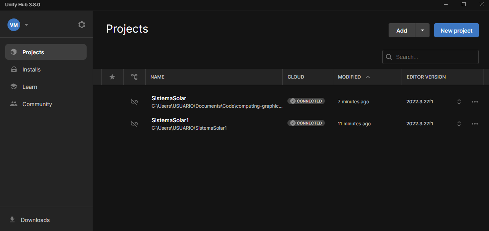

# computer-graphics-project
Simulación del sistema solar con Unity.


## Enunciado del proyecto
Dibujar una simulación del sistema solar. Los planetas deben tener las texturas 
adecuadas mapeadas. Trabajar con el escalamiento para que los planetas si se 
puedan observar (que las distancias no sean demasiado grandes). 

## Instalación y ejecución

Requerimientos:

    - Unity Editor 2022.3.27f1
    - Unity Hub 3.8.0

Puedes descargar el instalador desde la página oficial de [Unity](https://unity.com/download#how-get-started).

Luego debes clonar el repositorio en tu máquina local con el siguiente comando.

```
git clone https://github.com/vaalmo/computing-graphics-project.git
```

Una vez clonado, abres el Unity Hub y le das en la parte que dice agregar.



Seleccionas el directorio llamado 'SistemaSolar', y ya estaría listo para abrir con el editor. 


